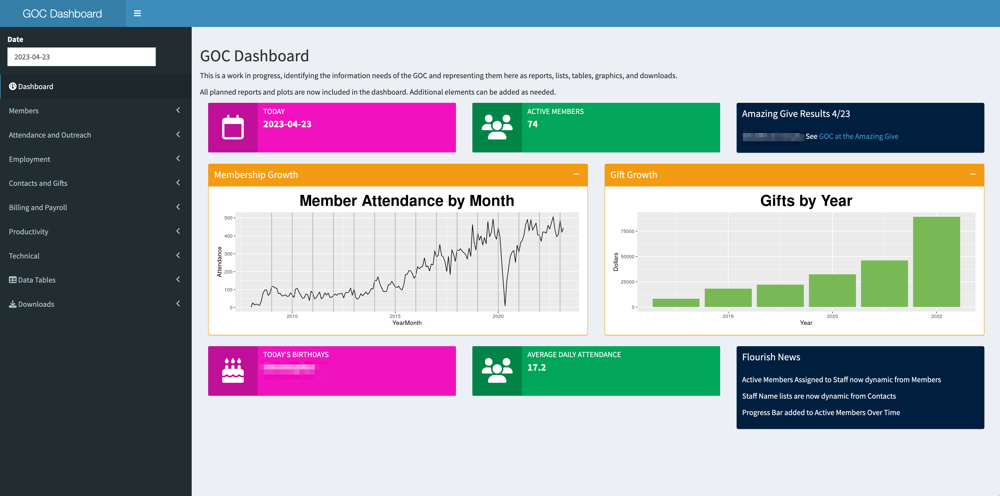

# Gainesville Opportunity Center

The [Gainesville Opportunity Center](https://goclubhouse.org) (GOC) is using R to create reports, including listings,
summaries, billing data, email lists for solicitation, board reports, and graphics.  These reports will be accessible from [Flourish](https://clubhousedata.org/), the hosted GOC data system by [Form Communities](https://formcommunities.org/)

A dashboard is being built using [Shiny](https://shiny.rstudio.com/) to organize reports and other data presentations from Flourish.  The dashboard will be hosted by Form Communities.

## Modules

The GOC has implemented 10 Flourish modules:

1. Members. Just Members.  Prospects are in Contacts.
1. Contacts. All Members are contacts, but not all contacts are Members.  Contacts include donors, volunteers, community partners, staff, and many others.
1. Gifts. All gifts, including in-kind.
1. Attendance.  All attendnace, including staff, visitors, and volunteers.
1. Outreach.  Outreach to Members.
1. Employment.  One record per "employment" -- start/end with a specific employer.  Employers in Contacts.
1. Supports.  One record per support -- Members and a Staff Member participating in a clubhouse activity.
1. Goals and Plans.  One record per goal with associated plan.  Members have multiple goals.
1. Progress Notes.  One progress note per month per goal.
1. Users.  The users of the sstem, including accesss roles.

### Future Modules

The GOC plans to implement

1. Education.  One record per "education" -- start/end with a specific education program.  Education providers in contacts.
1. Group Events.  One record per event -- date/time/location/duration.  With associated members and staff.

## Dashboard

The GOC Dashboard has 3 widgets, 48 reports, 8 plots, 10 table viewers, 1 technical figure, and 11 downloads. 

Some highlights:

* Members with staff assignments showing attendance, supports, goals, and progress notes
* Sign in sheets, attendance and outreach reports
* Donations by year, campaign, top donors
* Billing reports for grants
* Payroll reports for staff
* Productivity reports
* Board reporting
* System information including database record counts, and field usage by table

## To Do (software only)

1. Implement R Server batch jobs on Form Communities instance
    1. Implement https on R server
    1. Implement keychain dependencies on R Server
    1. Implement keychain on R server
    1. Batch job to synch Members and Contacts (requires keychain and https)
    1. Batch jobs to pre-calculate and speed-up common data requests, such as 90 day attendance, active members, current staff
1. Move dashboard from commercial hosting to Form Communities hosting
    1. Implement https on Shiny Server
    1. Implement authentication on Shiny server
    1. Implement rsconnect on Shiny Server
    1. Move and test dashboard on Shiny Server (requires https, authentication, and rsconnect)
    1. End account on commercial server
1. Implement data caching in dashboard to improve response time
1. Implement goctools library to provide access to required code for both local and dashboard use
1. Provide a mechanism for staff update of news boxes, or remove them
1. Improve code organization and consistency
    1. Remove dependency on .RData, all code should be in goctools
    1. Improve older reports to use current coding paradigms
1. Add reports as need for operational use at the GOC.  Some anticipated reports are:
    1. ARPA billing report -- when requirements are developed
    1. Wellness billing report -- when event attendance is implemented
    1. Education tracking report -- when education tracking is implemented
    1. Transportation tracking report -- when transportation logging is implemented
    1. Download mailing lists for use in MailChimp
